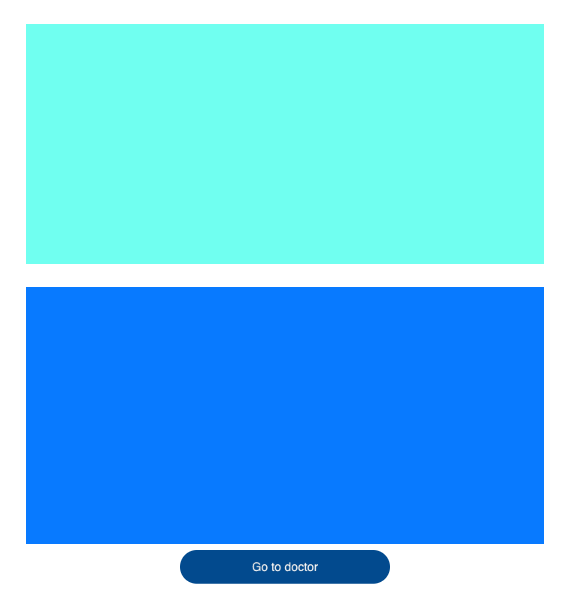
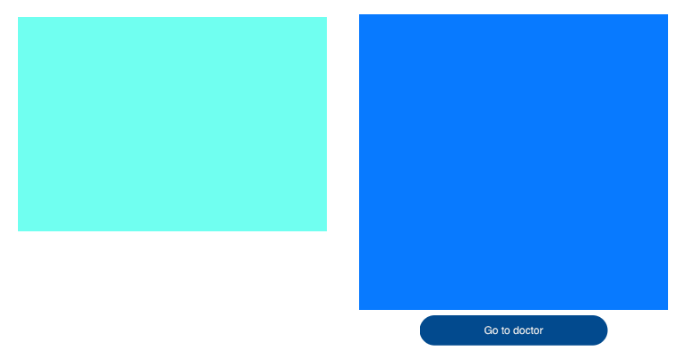
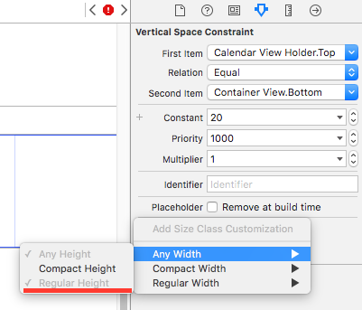
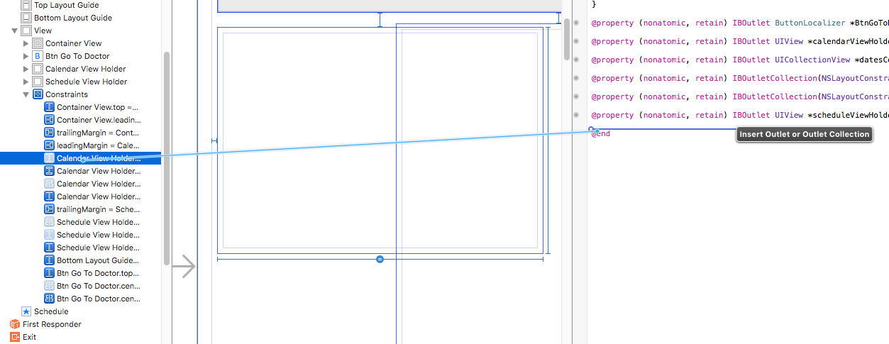
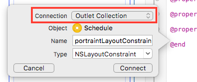
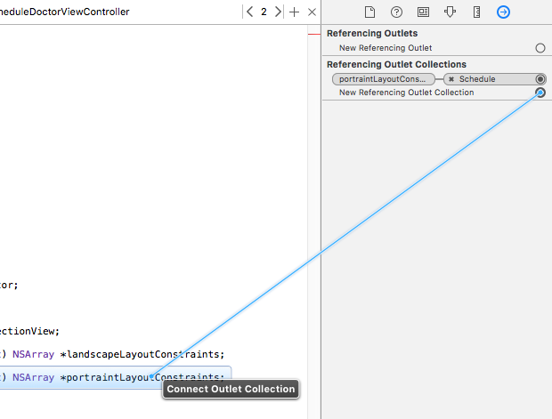

Хороший интерфейс пользователя должен быть адаптивным и изменяться в зависимости от размера и соотношения сторон экрана. Всем известно, что компания Apple обладает своим собственным подходом к построению интерфейса. В отличии от Android, для того чтобы нарисовать интерфейс для iOS не достаточно описать его с помощью декларативного языка. На iOS придется работать в Interface Builder, рисовать контролы ручками и описывать их взаимоотношения при помощи “ограничений” (Auto Layout Constraints).

Точно так же Apple обладает своим собственным видением того, как реагировать на изменение размера и соотношений сторон экрана. Для того, чтобы правильно отображать интерфейс для различных экранов Apple предлагает разработчику инструмент под названием Size Classes. Если кратко — то всего существует 2 сайз класса (один для горизонтали, второй для вертикали), каждый из которых может иметь одно из двух значений (Regular — обычный и Compact — компактный). При этом в зависимости от типа устройства и его ориентации эти сайз классы изменяют свои значения.

Например для iPhone 5 в портретной ориентации горизонтальный сайз класс будет иметь значение Compact, а вертикальный — Regular. Если iPhone развернуть в ландшафт — то сайз классы поменяются местами (горизонталь станет Regular, вертикаль — Compact).

Таким образом начиная с iOS 7 на Size classes завязано все изменение лэйаутов в Interface Builder. При этом нельзя нарисовать два лэйаута для разных наборов сайз классов — нам необходимо включать или выключать констрейнты (Auto Layout Constraints) в зависимости от значения сайз класса. Уже на устройстве система сама поймет какие сайз классы в данный момент активны и автоматически отключит или включит соответствующие констрейнты, интерфейс будет выглядеть по разному в ландшафте или портрете.

В случае iPad картина выглядит иначе. **Планшет обладает одинаковым значением сайз классов для горизонтали и вертикали в любой ориентации.** Такое поведение системы добавляет некоторые сложности, когда нам нужно для портрета и ландшафта иметь различные лэйауты, например так:





Но существует способ обойти такое поведение системы, для этого необходимо выполнить следующее:

1. Добавить отдельные констрейнты для ландшафта и портрета
2. Вывести две *IBOutlet Collection* (одну для портрета, вторую для ландшафта) и привязать соответствующие констрейнты к соответствующему аутлету
3. В коде подписаться обзервером на событие *UIDeviceOrientationDidChangeNotification*. По событию проверять идиому интерфейса пользователя и по ориентации статус бара понимать как развернуто устройство, и активировать соответствующий набор констрейнтов

Пройдемся краткой по основным этапам.

## Добавить отдельные констрейнты для ландшафта и портрета

Чтобы правильно добавить необходимые констрейнты необходимо действовать в следующем порядке:

1. Для начала нарисовать лэйаут под портретную ориентацию
2. Понять какие констрейнты будут общими, а какие будут относиться только к портрету
3. Для каждого **не общего** констрейнта добавить его вариант для любой ширины и Regular высоты (Any Width & Regular Height)



4. Далее выключить этот констрейнт в версии без указания сайз классов
5. Повторить пункты 3 и 4 для всех констрейнтов, которые будут уникальными для портретной ориентации
6. Теперь необходимо на том же экране добавить констрейнты для ландшафтной ориентации
7. Для всех констрейнтов, уникальных для ландшафтной ориентации добавить их варианты для любой ширины и компактной высоты (Any Width & Compact Height)
8. Далее выключить этот констрейнт в версии без указания сайз классов
9. Повторить пункты 7 и 8 для всех констрейнтов, которые будут уникальными для ландшафтной ориентации

## Вывести две IBOutlet Collection (одну для портрета, вторую для ландшафта) и привязать соответствующие констрейнты к соответствующему аутлету

Например начнем с портретных констрейнтов, откроем Assistant Editor, найдем в левом пане наш констрейнт (он сейчас должен быть выключен) и перетянем его (**с зажатым Ctrl**) в пан с кодом (Assistant Editor)



В окне задания свойств аутлета необходимо ввести его имя и обязательно выбрать в поле Connection значение **Outlet Collection**.



Далее нажать Connect — наш новый аутлет свяжется с констрейнтом. Далее необходимо осуществить хитрость — не достаточно просто повторить предыдущие шаги с оставшимися констрейнтами для портретной ориентации. Оставшиеся коснтрейнты необходимо соединять с нашим аутлетом через окно инспектора соединений (Connections Inspector). Для этого необходимо выделить констрейнт, открыть его инспектор соединений и из поля Referencing Outlet Collections вытянуть соединение с нашим аутлетом.



На этом работа в Interface Builder закончена.

## В коде подписаться обзервером на событие “UIDeviceOrientationDidChangeNotification”

В коде нашего контроллера в методе *viewDidLoad* необходимо подписаться на событие обзервера *UIDeviceOrientationDidChangeNotification*. Оно будет вызываться всякий раз, когда ориентация устройства изменяется.

```csharp
NSNotificationCenter.DefaultCenter.AddObserver(new NSString("UIDeviceOrientationDidChangeNotification"), (notification) =>
{
	UpdateControlsFrames();
});
```

Далее необходимо реализовать метод *UpdateControlsFrames()* и внутри него по идиоме интерфейса и положению статус бара активировать констрейнты либо портрета, либо ландшафта.

```csharp
void UpdateControlsFrames()
{
	if ((new UIDevice()).UserInterfaceIdiom != UIUserInterfaceIdiom.Pad)
	{
		return;
	}

	bool isPortraint = true;
	if (UIApplication.SharedApplication.StatusBarOrientation == UIInterfaceOrientation.LandscapeLeft
		|| UIApplication.SharedApplication.StatusBarOrientation == UIInterfaceOrientation.LandscapeRight)
	{
		isPortraint = false;
	}

	if (isPortraint)
	{
		NSLayoutConstraint.DeactivateConstraints(landscapeLayoutConstraints);
		NSLayoutConstraint.ActivateConstraints(portraintLayoutConstraints);
	}
	else
	{
		NSLayoutConstraint.DeactivateConstraints(portraintLayoutConstraints);
		NSLayoutConstraint.ActivateConstraints(landscapeLayoutConstraints);
	}

	View.SetNeedsLayout();
	View.LayoutSubviews();
}
```

Стоит сказать о том, что после активации констрейнтов необходимо вызвать *SetNeedsLayout()* и *LayoutSubviews()* у корневой *View*, чтобы она перерисовалась с учетом последних изменений.
