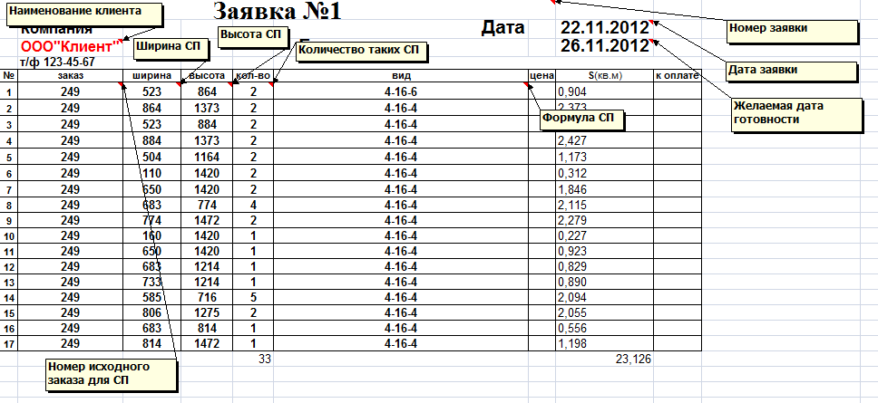
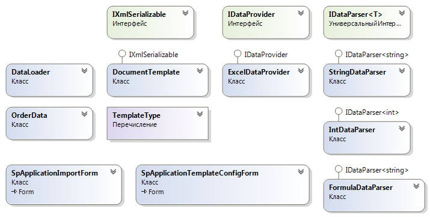
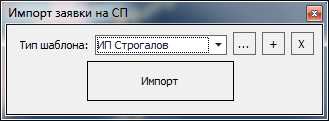
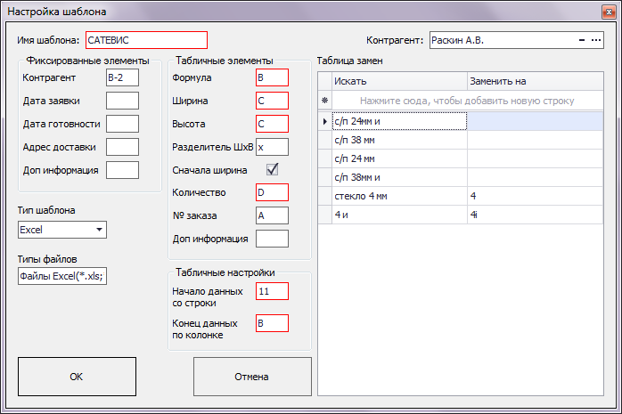

Одной из задач последних двух месяцев было написание универсального средства для импорта заявок на стеклопакеты (далее СП). Почему нужно именно универсальное средство и в чем его универсальность, спросите вы.

Для любого крупного производителя СП рано или поздно встает вопрос об автоматизированном приеме заявок от клиентов. Поток заказов (заявок) растет, вносить их вручную становится экономически не выгодно. Очень крупные предприятия (например СТИС) могут себе позволить разработать собственный формат заявки и заставить своих клиентов использовать только его, но заводы поменьше не могут себе позволить такую роскошь — им приходится принимать заявки в том формате, в котором хочет клиент. На такие предприятия и рассчитывалось данное универсальное средство импорта.

Формат заявки может очень сильно отличаться, наиболее распространенным естественно является обычный Excel, некоторые клиенты отправляют заявку в формате CSV. Самые суровые формируют заявку в WORD или просто пишут на бумажке, сканируют и отправляют по электронной почте.

На данный момент средство импорта имеет поддержку Excel, CSV и Word, но в данной статье мы опишем только импорт из Excel и CSV. Поддержку Word добавлял мой коллега и друг [Евгений Мельник](https://drmiller-developer.blogspot.ru/), если он захочет — расскажет про этот вид импорта.

Итак основные задачи, которые ставились перед нами:

- Разработать архитектуру, предоставляющую инфраструктуру для импорта заявок;
- Должна быть возможность легко добавлять новые форматы файлов для импорта без правки архитектуры, простой реализацией собственных классов;
- Должна быть возможность создавать шаблоны для импорта под каждого конкретного контрагента;
- Средство импорта должно преобразовывать любой бред, написанный контрагентом в заявке в понятные основному ПП данные, это в первую очередь касается формулы СП (об этом поговорим отдельно);
- Создать интерфейс, позволяющий выбрать соответствующий шаблон и импортировать заявку;
- Добавить административный интерфейс, позволяющий создавать, редактировать и удалять шаблоны заявок;
- Предоставить возможность разграничить права на интерфейсы пользователя;
- Полная интеграция с основным ПП нашей компании — winDraw;
- Используем C# 2.0 и компоненты DevExpress 10.2.

Говоря о шаблонах для каждого контрагента и преобразовании его данных в данные, понятные основному ПП нужно понимать одну особенность производства СП.

Видов стеклопакетов существует огромное количество, и речь идет не только об их форме, но в первую очередь об их **формуле**. Пакет может быть однокамерным (состоять из 2-х стекол и одной рамки), а может быть двухкамерным (состоять из 3 стекол и двух рамок). Также может сильно отличаться тип стекол в пакете, это может быть просто 4-мм стекол, а может быть и 5-мм, 6-мм. Стекло может быть закаленным, армированным, это может быть триплекс (состоит из трех стекол, склеенных между собой). На стекло может быть наклеена пленка, бронировочная или просто цветная. Она может быть наклеена только на 1-е стекло, а может и на оба. Размер камеры (толщина дистанционной рамки) может существенно различаться. В камеру может быть закачан аргон или другой газ.

Как вы видите нюансов очень много. Специально, что бы установить хоть какую-то систему во всем этом многообразии был разработан ГОСТ, описывающий СП в целом и маркировку СП в частности [ГОСТ 24866-99](https://www.google.ru/search?q=%D0%93%D0%9E%D0%A1%D0%A2+24866-99). Но большинство клиентов не стремятся использовать стандарт, им просто нужно получить свои стеклопакеты. И тут начинается самое интересное. Клиент пишет вместо стандартного разделителя «x» тире «-» или пробел. Либо просто пишет в заявке «Двухкамерный СП из стекла 4мм». Описываемые клиентом маркировки стекол могут существенно отличаться от маркировок, указанных в программе.

Поскольку предусмотреть все варианты написания того или иного стекла или рамки физически невозможно, было принято решение — для каждого клиента создать таблицу замен его написания на наше. Но, если использовать таблицу замен может возникнуть проблема литерал **AR**, описывающий аргон легко может *поломать* строку **HP CARBON 05**, которая описывает пленку. Т.е, что бы таблица замен работала корректно нужно производить поиск и замену сначала самых длинных литералов, а затем более коротких. Необходимо просто вычислить длину строки при добавлении и хранить ее рядом с литералом для замены, тогда определение порядка просмотра таблицы становится очевидным.

Простая заявка на СП выглядит следующим образом:



Если проанализировать ее формат становится ясно, что состоит она из 2-х частей:

- Заголовочная часть, которая содержит основную информацию о компании-клиенте, номере заявки, дате отправки и желаемой дате получения стеклопакетов;
- Табличной части с формулами СП, их размерами и количеством.

Стало ясно, что наиболее простым внутренним представлением данных будем именно табличный формат, используем **DataTable** как основное хранилище исходных данных

Была разработана следующая архитектура, рассмотрим ее подробнее:



Основу всего составляют 3 интерфейса:

- **IDataProvider** — этот интерфейс реализуют классы, которые предоставляют данные для импорта. Т. е. преобразуют исходный файл в понятную ядру таблицу;
- **IDataParser\<T>** — интерфейс, который позволит реализовать классы, преобразующие клиентский *бред* в понятные нам данные (организует работу с таблицей замен, преобразует строки в числа, разложит формат габаритных размеров СП в понятные нам два числа);
- **IXmlSerializable** — нужен для сериализации/десериализации шаблонов клиентов.

Рассмотрим код наших интерфейсов:

```csharp
interface IDataParser<T>
{
    T Parse(string val, DocumentTemplate template);
}
...
interface IDataProvider
{
     /// <summary>
    /// Возвращает тип провайдера (Excel, CSV, Word и т.д.)
    /// </summary>
    string ProviderType { get; }

    /// <summary>
    /// Необходимо задавать фильтр расширений для файла, загружаемого провайдером
    /// </summary>
    string FileExtensionFilter { get; }

    /// <summary>
    /// Загружает данные и возвращает таблицу для разбора
    /// </summary>
    /// <returns>Таблица для разбора</returns>
    DataTable LoadData();
}
...
interface IXmlSerializable
{
    XmlElement Serialize(XmlDocument doc);
    bool Deserialize(XmlElement element);
}
```

Все выглядит очень просто. Стоит отдельно сказать про класс *DocumentTemplate*, это как раз то место, в котором хранится вся информация о шаблоне под конкретного клиента, а именно:

- Какой формат используется для загрузки этого шаблона (какой провайдер данных);
- С какой строки начинается табличная часть;
- Какую колонку нужно анализировать в табличной части, что бы понять, что она закончилась (просто смотрит, если в колонке нет данных — значит табличная часть закончилась);
- Хранит список экземпляров класса *TemplateField* для табличной части и заголовочной части (*TemplateField* описывает конкретное поле в таблице, его номер строки и колонки, внутреннее имя, содержит описание);
- Хранит таблицу замен для преобразования формул СП клиента в формулы СП основной программы;
- Хранит объект типа *CustomerInformation*, описывающий данные клиента (id клиента, его наименование), для подстановки в сформированный заказ после импорта;
- Реализует методы интерфейса *IXmlSerializable* для сериализации/десериализации.

Шаблон сам по себе ничего не делает, он просто хранит данные. Сердцем всего является класс *DataLoader*

Код данного класса особо ничем не примечателен, за исключением кода загрузки заявки по выбранному шаблону:

```csharp
/// <summary>
/// Загружает заявку по выбранному шаблону
/// </summary>
/// <param name="template"></param>
private void LoadTemplate(DocumentTemplate template)
{
    if(template == null) return;

    //выберем провайдер и инициализируем его
    IDataProvider provider = null;
    if (template.Type == "Excel") provider = new ExcelDataProvider();
    if (template.Type == "Word") provider = new WordDataProvider();

    if (provider == null)
    {
        throw new ApplicationException("Ошибка при поиске провайдера данных для шаблона с типом \"" + template.Type + "\"");
    }

    //загрузим данные через провайдер
    DataTable dtData = provider.LoadData();
    if (dtData == null)
    {
        throw new ApplicationException("Ошибка при загрузке данных из файла");
    }

    //получим массивы заголовочных полей и табличных полей, что бы найти данные в таблице, предоставленной провайдером
    DocumentTemplate.TemplateField[] headerFields = template.HeaderFields;
    DocumentTemplate.TemplateField[] tableFields = template.TableField;

    //инициализируем класс, который работает с заказом winDraw, вся спицифичная кухня, касающаяся winDraw происходит внутри
    OrderData orderData = new OrderData();

    //далее используя шаблон и таблицу от провайдера будем заполнять данные в OrderData
    if (template.Customer != null)
    {
        orderData.CustomerInformation = template.Customer.Clone();
    }

    //сначала вытащим все данные из шапки
    foreach (DocumentTemplate.TemplateField field in headerFields)
    {
        switch (field.Name)
        {
            case "customer":
                orderData.Customer = GetHeaderStringData(field, dtData);
                break;

            case "shipmentAddress":
                orderData.ShipmentAddress = GetHeaderStringData(field, dtData);
                break;

            case "comment":
                orderData.Comment = GetHeaderStringData(field, dtData);
                break;

            case "dateApplication":
                orderData.DateApplication = GetHeaderStringData(field, dtData);
                break;

            case "dateShipment":
                orderData.DateShipment = GetHeaderStringData(field, dtData);
                break;
        }
    }

    //теперь вытащим все данные из табличной части
    for (int idx = template.TablePartStartRow; idx < dtData.Rows.Count; idx++)
    {
        DataRow currentRow = dtData.Rows[idx];
        //условие прекращения работы цикла, когда данные в таблице закончились
        if(currentRow[template.TablePartEndColumn] == DBNull.Value || string.IsNullOrEmpty(currentRow[template.TablePartEndColumn].ToString())) break;

        OrderData.OrderPositionData position = orderData.AddNewPosition();

        DocumentTemplate.TemplateField fieldWidth = null;
        DocumentTemplate.TemplateField fieldHeight = null;

        foreach (DocumentTemplate.TemplateField field in tableFields)
        {
            switch (field.Name)
            {
                case "formula":
                    position.Formula = GetTableFormulaData(field, currentRow, template);
                    break;

                case "width":
                    fieldWidth = field;
                    break;

                case "height":
                    fieldHeight = field;
                    break;

                case "qu":
                    position.Qu = GetTableIntData(field, currentRow);
                    break;

                case "comment":
                    position.Comment = GetTableStringData(field, currentRow);
                    break;

                case "orderName":
                    position.OrderName = GetTableStringData(field, currentRow);
                    break;
            }
        }

        if(fieldWidth == null || fieldHeight == null) throw new ApplicationException("Ошибка при загрузке полей Ширина, Высота");

        //если колонка ширины равна колонке высоты - значит наш клиент пишет ширину и высоту через спец сепаратор :)
        if (fieldWidth.Column == fieldHeight.Column)
        {
            if (currentRow[fieldWidth.Column] != DBNull.Value)
            {
                string val = currentRow[fieldWidth.Column].ToString();

                //тут применен такой хитрый хак, из-за того, что для Word нужно более одного сепаратора при расчленении строки
                string[] separators = template.WidthHeightSeparator.Split(new char[] {'|'});
                string[] par = val.Split(separators,
                    StringSplitOptions.RemoveEmptyEntries);

                position.Width = _intParser.Parse(par[0], template);
                position.Height = _intParser.Parse(par[1], template);
            }
        }
        else
        {
            //иначе наш клиент молодец и пишет ширину/высоту в разных столбцах
            position.Width = GetTableIntData(fieldWidth, currentRow);
            position.Height = GetTableIntData(fieldHeight, currentRow);
        }
    }

    //в финале создаем заказ
    orderData.CreateOrder();
}
```

Интерес так же могут вызвать методы:

```csharp
private string GetHeaderStringData(DocumentTemplate.TemplateField field, DataTable dtData)
private string GetTableStringData(DocumentTemplate.TemplateField field, DataRow currentRow)
private string GetTableFormulaData(DocumentTemplate.TemplateField field, DataRow currentRow, DocumentTemplate template)
private int GetTableIntData(DocumentTemplate.TemplateField field, DataRow currentRow)
```

Это всего лишь обертки над классами-парсерами, реализующими интерфейс *IDataParser\<T>*. Рассмотрим их подробнее:

```csharp
/// <summary>
/// Строковый парсер
/// </summary>
public class StringDataParser : IDataParser<string>
{
    public string Parse(string val, DocumentTemplate template)
    {
        return val.Trim();
    }
}

/// <summary>
/// Парсер чисел
/// </summary>
public class IntDataParser : IDataParser<int>
{
    public int Parse(string val, DocumentTemplate template)
    {
        return Convert.ToInt32(GetOnlyNumericInformation(val));
    }

    /// <summary>
    /// Оставляет только ту информацию, которая относится к числовой (числа, знаки , и .)
    /// Так же исключает сливание вместе двух чисел, например:
    /// ,113,33 443 - будет равно 133,33
    /// </summary>
    /// <param name="val"></param>
    /// <returns></returns>
    private string GetOnlyNumericInformation(string val)
    {
        val = val.Trim();
        bool digitsStarted = false;

        StringBuilder sb = new StringBuilder();
        for (int idx = 0; idx < val.Length; idx++)
        {
            char c = val[idx];

            if (IsNumericChar(c))
            {
                if (!digitsStarted) digitsStarted = true;
                sb.Append(c);
            }
            else
            {
                if(digitsStarted) break;
            }
        }

        string result = sb.ToString().Trim(',').Trim('.');
        return result.Replace(',', '.');
    }

    /// <summary>
    /// Свой вариант метода char.IsDigit, считает числовым еще и символы: . ,
    /// </summary>
    /// <param name="c"></param>
    /// <returns></returns>
    private bool IsNumericChar(char c)
    {
        return char.IsDigit(c) || c == ',' || c == '.';
    }
}

/// <summary>
/// Парсер формулы СП
/// </summary>
public class FormulaDataParser : IDataParser<string>
{
    public string Parse(string val, DocumentTemplate template)
    {
        foreach (DataRow dr in template.DtChanges.Select("", "complexity DESC"))
        {
            string searchString = dr["search"].ToString();
            string replaceString = dr["replace"].ToString();

            val = val.Replace(searchString, replaceString);
        }

        return val;
    }
}
```

Самое интересное происходит в классе *FormulaDataParser*, тут мы видим как преобразовать формулу СП клиента в понятную нам формулу, используя таблицу замен. При этом в поле *complexity* хранится длина исходной строки, что бы организовать последовательность просмотра таблицы в правильном порядке

И в конце хочется показать что же получилось, как выглядит интерфейс пользователя:

Окно, которое видит менеджер. Можно выбрать шаблон заявки и импортировать ее



Окно, которое видит администратор по конкретной заявке. Можно настроить все параметры полей (заголовочных и табличных), а так же заполнить таблицу замен


